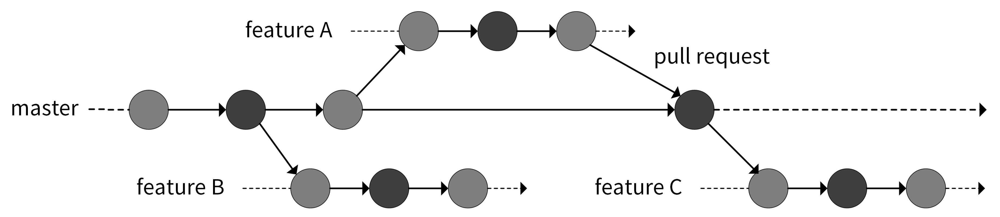
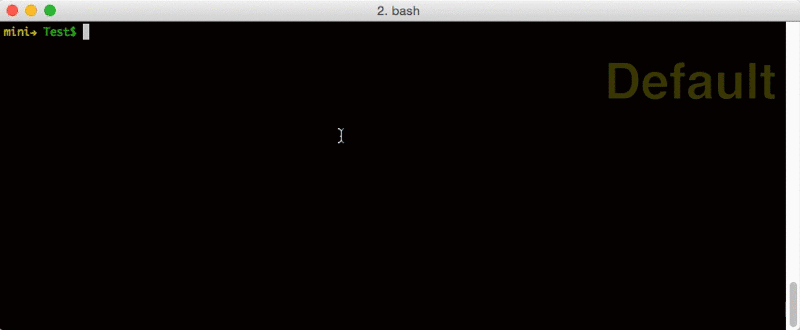

## git分支规范


|  分支名   | 描述  |
|  ----  | ----  |
| main/master  | 核心分支，不要在该分支上直接开发 |
| develop  | 测试分支，功能开发完成后合并到该分支进行测试 |
| feature  | 功能开发分支，所有开发分支都从main/master新建 |
| fix | bug修复分支，所有开发分支都从main/master新建 |

```
//分支名称规范

feature/print-hello-world
```



## gitlint
commit信息规范工具，通过git-hooks调用该工具进行commit-msg检查

```
//一个规范的commit message

fix(v-on): add removing all dom event listeners
```

https://github.com/llorllale/go-gitlint

## commitizen-go
交互式生成合格的commit-msg



https://github.com/lintingzhen/commitizen-go

https://github.com/xiaoqidun/gitcz

## golangci-lint
代码静态检查工具


https://github.com/golangci/golangci-lint